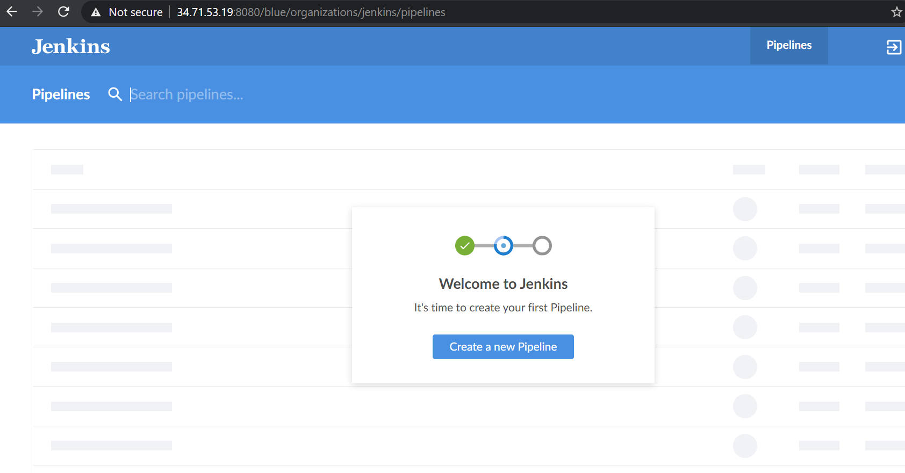
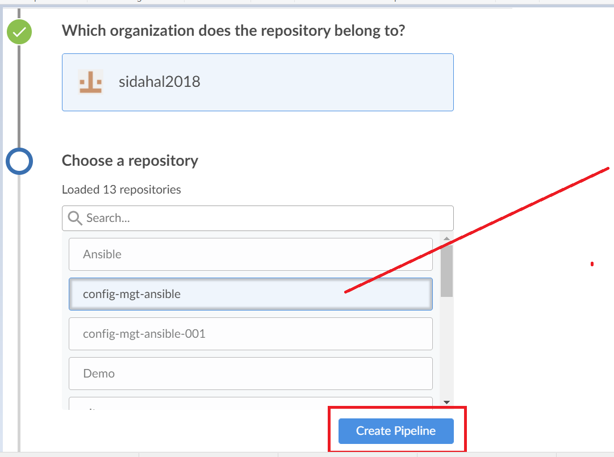
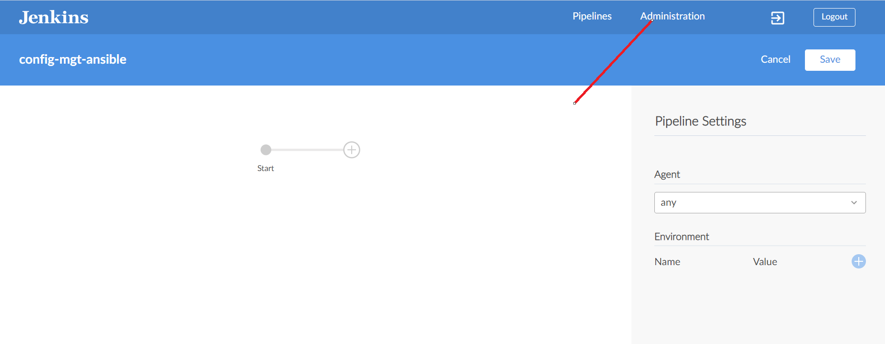
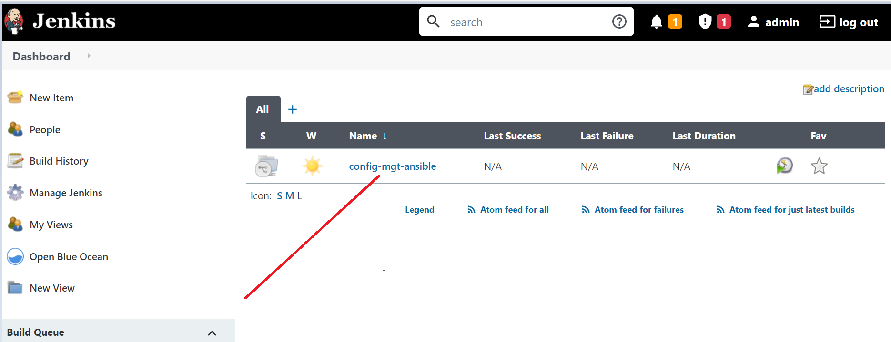
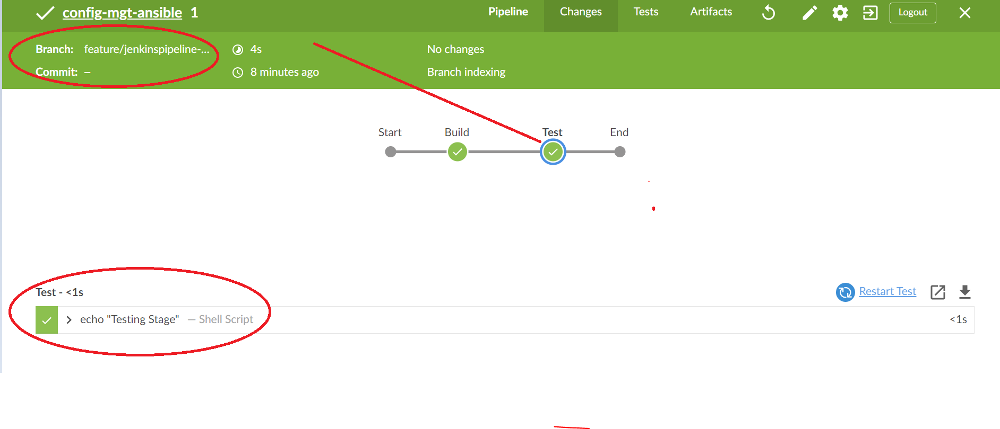
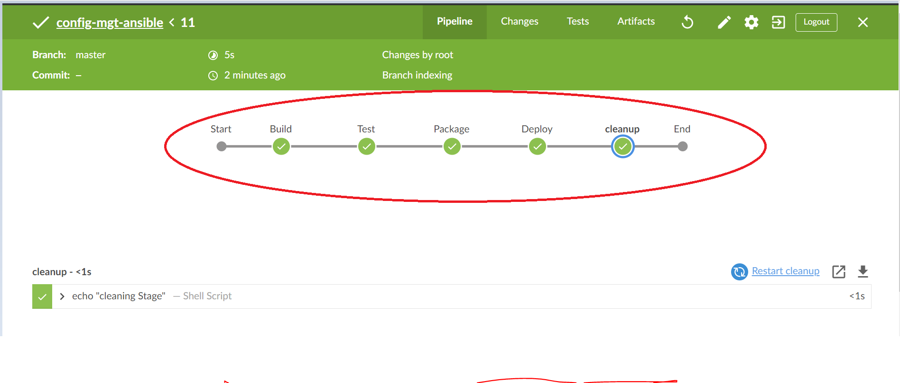

## Experience Continous Integration With Jenkins | Ansible | Artifactory | Sonarqube | PHP ##

Let's discuss the most important and fundamental concept in DevOps.

In the past, you have been working on Linux and Ansible and just a basic overview with hands on Jenkins. Here, there is a lot to understand and do. Therefore, there will be a bit of theory at the start. But trust me, it is all worth it. This will set the stage for you to truly understand why you need to build and configure the things that will be happening in this project.

In previous project, you deployed the tooling website directly into the `/var/www/html` folder on the dev server. Well, even though that worked, and we are still able to access the website, it is not the best way to go. In the real world, most application code like `java` `.net` etc are usually compiled and built to create an executable file. The executable file such as `jar` file in the case of `java` will contain all the code embeded, and the necessary library dependencies in which the application needs to run and work successfully. Some other programs like `PHP` work directly without building into some executable file. That is why we could easily deploy the entire code from git into `var/www/html` and immediately the webserver is able to render the pages on the browser. However, it is not ideal to download code directly from `git` on to our servers. There should be a smarter way to package the entire application code, and track the release versions. We cna package the entire code and all its dependencies into some form like `.tar.gz` or `.zip` so that it can be easily unpacked on the respective environment’s servers.

In this project, you will understand and get hands on experience around the entire concept around CI/CD from applications perspective. To fully gain real expertise around this idea, it is best to see it in action across different programming languages and from the platform perspective too. From the application perspective, we will be focusing on PHP here; There are more projects ahead that are based on Java, NODEJS, .Net and Python. By the time you start working on Terraform, Docker and Kubernetes projects, you will get to see the platform perspective of CI/CD in action.

What is Continous Integration
In software engineering, continuous integration (CI) is the practice of merging all developers’ working copies to a shared mainline (Git Repository) several times a day. This means multiple git commit, several times everyday.

The general idea behind multiple commits is to avoid what is generally considered as Merge Hell or Integration hell. When a new developer joins a new project, he will have to create a copy of the main codebase by creating a new git feature branch from the mainline. In some organization or team, this could be the develop, main or master branch to develop his own features. If there are tens of developers working on the project, they will all do the same thing. Which is the case in the real world. Some projects even have hundreds of developers working on the same solution. Maybe a mobile application, website or a web app. As each developer work on their own feature branch, the main branch they took a copy from will start drifting away. If this linger on for a very long time without re-conciling the code, then this will cause a lot of code conflict or Merge Hell as rightly said. Imagine such a hell from tens of developers or worse, hundreds. So the best thing to do, is to continously commit code to the mainline. As many times as tens of times per day. With this practice, you can avoid Merge Hell or Integration hell

CI concept does not really end at just commiting your code. There is a general workflow. Lets start exploring the flow…

Run tests locally: Before developers commit their code to the central repository (Git repository), it is best practice to test the code locally before commit. So, test-driven development is used in combination with CI. Developers will write tests for their code called unit-tests, and before they commit their work, they will use some tools to run their tests locally. This practice helps the team to avoid having developer’s work-in-progress code from breaking other developer’s copy of the code-base.

Compile code in CI: After testing the code locally, developers will commit and push their work to GIT. Rather than building the code into an executable locally, a dedicated server for CI will pick up the code and run the build there. For the sake of this particular project, we will use Jenkins as our CI server. This happens either periodically by polling the repository at every X mins/hours configured, or after every commit. Having a CI server where this build runs is a good practice for the team as everyone will have visibility into each commit and its corresponding build.

Run further tests in CI: Even though tests have been ran locally by developers, it is important to also run the unit-tests on the CI server as part of the continous process. But, rather than focusing solely on unit-tests, there are other kinds of tests and code analysis thay can be done using the CI server. These are very critical to determining the overall quality of code being developed, how it interact with other developers work, and how less vulnerable it is to attacks. The CI server uses different tools for Static Code Analysis, Code Coverage Analysis, Code smells Analysis, and Compliance Analysis. In addition, it runs other tests such as Integration, and Penetration tests. Other tasks perfomed on the CI server include producing code documentation from the source code, and facilitate manual quality assurance (QA) testing processes.

Deploy an artifact from CI: At this stage, the difference between CI and CD is spelt out. As you now know, CI is Continous Integration, which is everything we have been discussing thus far. CD on the otherhand is Continous Delivery which ensures that software checked into the mainline is always ready to be deployed to users. The deployment here is manually triggered after certain QA tasks is completely satisfactory. There is another CD known as Continous Deployment which is also about deploying the software to the users, but rather than manual, it makes the entire process fully automated.

Continous Integration In The Real World
To emphasize a typical CI Pipeline further, Let us explore the diagram below a little deeper.

_images/CI-Pipeline-Regular.pngSource: whitesourcesoftware

* Version Control: This is the stage where developers’ code gets committed and pushed after they have tested their work locally.

* Build: Depending on the type of language or technology, we may need to packaged code dependencies and build to a computer language. Some languages like PHP or Javascript do not require to be built because they are scripting or interpreted languages. While languages such as Java, C, Golang, Scala, .Net, etc are compiled languages. Their syntax cannot be directly understood by the computer. They require the Build phase which means must be compiled to a binary file that can be understood by the computer. here is a good read to learn more about the differences between scripting and programming languages.

* Unit Test: Unit tests that have been developed by the developers are tested. Depending on how the CI job is configured, the entire pipeline may fail if part of the tests fail and developers will have to fix this failure before starting the pipeline again. A Job by the way, is a phase in the pipeline. Unit Test is a phase, therefore it can be considered a job on its own.

* Deploy: Once the tests pass, the next phase is to deploy the compiled or packaged code into an environment a code repository. This is where all the various versions of code including the latest will be stored. The CI tool will have to pick up the code from this location to proceed with the remaining parts of the pipeline.

* Auto Test: Apart from Unit testing, there are many other kinds of tests that are required to analyse the quality of code, and determine how vulnerable the software will be to external or internal attacks. These tests must be automated, and there can be multiple environments created to fulfil different test requirements. For example, a server dedicated to Integration Testing will have the code deployed there to conduct integration tests. Once that passes, there can be othere sub layers in the testing phase in which the code will be deployed to so as to conduct further tests. Such are User Acceptance Testing (UAT), and another can be Penetration Testing. These servers will be named according to what they have been designed to do in those environments. A UAT server is generally be used for UAT, SIT server is for Systems Integration Testing, PEN Server is for Penetration Testing and they can be named whatever the naming style or convention in which the team has adopted. An environment does not necessarily have to be one single server. It will in most cases be a stack as you have defined in your Ansible Inventory. All the servers in the inventory/dev are considered Dev Environment. The same goes for inventory/stage (Staging Environment) inventory/preprod (Pre-production environment), inventory/prod (Production environment) etc. So its all down to naming convention as agreed and used company or team wide.

* Deploy to production: Once all the tests have been conducted and either the release manager or whoever has the authority to authorize the release to the production server is happy, he gives the green light to hit the deploy button to production. This is an Ideal Continous Delivery Pipeline. If the entire pipeline was automated and no human is required to manually give the Go decision, then this would be considered Continous Deployment. Because the cycle will be repeated, and everytime there is a code commit and push, it causes the pipeline to trigger and the loop continues over and over.

* Measure And Validate: This is where live users are interating with the application and feedback is being gathered for improvement and bug fixes. There are many metrics that must be determined and observed here. We will quickly go through 15 metrics that MUST be considered.

Common Best Practices of CI/CD
* Maintain a code repository

* Automate the build

* Make the build self-testing

* Everyone commits to the baseline every day

* Every commit (to baseline) should be built

* Every bug-fix commit should come with a test case

* Keep the build fast

* Test in a clone of the production environment

* Make it easy to get the latest deliverables

* Everyone can see the results of the latest build

* Automate deployment

Why are we doing everything we are doing? - 13 DevOps Success Metrics
At the end of it all, DevOps is all about continous delivery or deployment, and being able to ship out quality code as fast as possible. This is a very ambitious thing to desire, therefore we must be careful not to break things as we are moving very fast. By tracking these metrics, we can determine our delivery speed and bottle necks before breaking things. Ultimately, the goals of DevOps is Velocity, Quality, and Performance. But how do we track these? Let us have a look at the 13 metrics to watch out for.

1 Deployment frequency: Tracking how often you do deployments is a good DevOps metric. Ultimately, the goal is to do more smaller deployments as often as possible. Reducing the size of deployments makes it easier to test and release. I would suggest counting both production and non-production deployments separately. How often you deploy to QA or pre-production environments is also important. You need to deploy early and often in QA to ensure time for testing.

2 Lead time: If the goal is shipping code quickly, this is a really key DevOps metric. I would define lead time as the amount of time that occurs between starting on a work item until it is deployed. This helps you know that if you started on a new work item today, how long would it take on average until it gets to production

3 Customer tickets: The best and worst indicator of application problems is customer support tickets and feedback. The last thing you want is for your users to find bugs or have problems with your software. Because of this, they also make a good indicator of application quality and performance problems.

4 Percentage of automated tests pass: To increase velocity, it is highly recommended that the development team makes extensive usage of unit and functional testing. Since DevOps relies heavily on automation, tracking how well automated tests work is a good DevOps metrics. It is good to know how often code changes are causing tests to break.

5 Defect escape rate: Do you know how many software defects are being found in production versus QA? If you want to ship code fast, you need to have confidence that you can find software defects before they get to production. Defect escape rate is a great DevOps metric to track how often those defects make it to production.

6 Availability: The last thing we ever want is for our application to be down. Depending on the type of application and how we deploy it, we may have a little downtime as part of scheduled maintenance. It is highly recommended to track this metric and all unplanned outages. Most software companies build status pages to track this. Such as this Google Products Status Page

7 Service level agreements: Most companies have some service level agreement (SLA) that they operate with. It is also important to track compliance with SLAs. Even if there are no formal SLA, there probably are application requirements or expectations to be achieved.

8 Failed deployments: We all hope this never happens, but how often do our deployments cause an outage or major issues for our users? Reversing a failed deployment is something we never want to do, but it is something you should always plan for. If you have issues with failed deployments, be sure to track this metric over time. This could also be seen as tracking *Mean Time To Failure8 (MTTF).

9 Error rates: Tracking error rates within the application is super important. Not only are they an indicator of quality problems, but also ongoing performance and uptime related issues. In software development, errors are also known as exceptions, and good exception handling best practices are very critical. If these are not handled nicely, we can figure it out while monitoring the rate of errors.

Bugs – Identify new exceptions being thrown in the code after a deployment

Production issues – Capture issues with database connections, query timeouts, and other related issues.

Presenting error rate metrics like this simply gives greater insights into where to focus attention. _images/Error-Rate.png

10 Application usage & traffic: After a deployment, we want to see if the amount of transactions or users accessing our system looks normal. If we suddenly have no traffic or a giant spike in traffic, something could be wrong. An attacker maybe routing traffic elsewhere, or initiating a DDOS attack

11 Application performance: Before we even do a deployment, we should configure monitoring tools like Retrace, DataDog, New Relic, or AppDynamics to look for performance problems, hidden errors, and other issues. During and after the deployment, we should also look for any changes in overall application performance, and begin to establish some benchmarks to know when things deviate from the norm.

It might be common after a deployment to see major changes in the usage of specific SQL queries, web service or HTTP calls, and other application dependencies. These monitoring tools can provide valuable visualizations like this one below that helps make it easy to spot problems.
_images/Application-Performance.webp

12 Mean time to detection (MTTD): When problems happen, it is important that we identify them quickly. The last thing we want is to have a major partial or broad system outage and not know about it. Having robust application monitoring and good coverage in place will help us detect issues quickly. Once they are detected, we also have to fix them quickly!

13 Mean time to recovery (MTTR): This metric helps us track how long it takes to recover from failures. A key metric for the business is keeping failures to a minimum and being able to recover from them quickly. It is typically measured in hours and may refer to business hours, not clock hours.

Simulating A typical CI/CD Pipeline for a PHP Based application
As part of the ongoing infrastructure development with Ansible from Project 11, we will create a pipeline that simulates continous integration and delivery. Our end to end CI/CD pipeline is represented in the diagram below. It is important to know that both Tooling and TODO WebApps are based on a scripting language (PHP). It means, without compiling the code to a machine language, it can be deployed directly onto a server and it just works.

The problem with that approach is, it would be difficult to package and version the software for different releases. And so, in this project, we will be using a different approach for releases, rather than downloading directly from git using Ansible uri module like we did in project 13.

_images/CI_CD-Pipeline-For-PHP-ToDo-Application.png

Set Up
This project is partly a continuation of your Ansible work, so simply add and subtract based on the n ew setup in this project. It will require a lot of servers to simulate all the different environments from dev/ci all the way to production. This will be quite a lot of servers altogether (But you don’t have to create them all at once. Only create servers required for an environment at a time. For example, when doing deployments for development, don’t create servers for integration, pentest, or production yet).

You should to take advantage of a cloud provider such as AWS or Digital Ocean to rent virtual machines. You can also use Google’s GCP and get $300 credit here or here (NOTE: Please read instructions carefully to get your credits) You can create a new AWS account if you have exhausted your free tier already.

NOTE: This is NOT a cloud project yet. AWS cloud end to end project begins from project-15 Therefore, do not worry about advance AWS configuration. All we need here is virtual machines that can be accessed over SSH

To minimize the cost of cloud servers, you dont have to create all the servers at once. simply spin minimal servers up as you progress through the project implementation and have reached a need for more.

To get started, we will focus on these environments initially.

Ci

Dev

Pentest

Both SIT - For Integration Testing and UAT - User Acceptance Testing do not require a lot of extra installation or configuration. They are basically the webservers holding our applications. But Pentest - For Penetration testing is where we will conduct security related tests, so some other tools and specific configurations will be needed. In some cases, it will also be used for Performance and Load testing. Otherwise, that can also be a separate environment on its own. It all depends on decisions made by the company and the team running the show.

What we want to achieve is having Nginx to serve as a reverse proxy for our sites and tools. Each environment setup is represented in the below table and diagrams.

_images/Environment-setup.png

CI-Environment
_images/Project-14-CI-Environment.png

Other Environments From Lower To Higher
_images/Project-14-Pentest-Environment.png

DNS requirements
Make DNS entries to create subdomain for each environment. Assuming your main domain is darey.io

You should have similar to this

Server	Domain
Jenkins	https://ci.infradev.darey.io
Sonarqube	https://sonar.infradev.darey.io
Artifactory	https://artifacts.infradev.darey.io
Production Tooling	https://tooling.darey.io
Pre-Prod Tooling	https://tooling.preprod.darey.io
Pentest Tooling	https://tooling.pentest.darey.io
UAT Tooling	https://tooling.uat.darey.io
SIT Tooling	https://tooling.sit.darey.io
Dev Tooling	https://tooling.dev.darey.io
Production TODO-WebApp	https://todo.darey.io
Pre-Prod TODO-WebApp	https://todo.preprod.darey.io
Pentest TODO-WebApp	https://todo.pentest.darey.io
UAT TODO-WebApp	https://todo.uat.darey.io
SIT TODO-WebApp	https://todo.sit.darey.io
Dev TODO-WebApp	https://todo.dev.darey.io
Ansible Inventory should look like this
├── ci
├── dev
├── pentest
├── pre-prod
├── prod
├── sit
└── uat
ci inventory file

[jenkins]
18.156.178.41

[nginx]
18.159.134.59

[sonarqube]
3.127.220.122

[artifact_repository]
35.158.126.155
dev Inventory file

[tooling]
3.127.98.117

[todo]
18.194.38.231

[nginx]
18.159.134.56

[db:vars]
ansible_user=ec2-user
ansible_python_interpreter=/usr/bin/python

[db]
18.192.42.151
pentest inventory file

[pentest:children]
pentest-todo
pentest-tooling

[pentest-todo]
18.185.240.182

[pentest-tooling]
18.193.115.188
Observations:

You will notice that in the pentest inventory file, we have introduced a new concept pentest:children This is because, we want to have a group called pentest which covers Ansible execution against both pentest-todo and pentest-tooling simultaneously. But at the same time, we want the flexibility to run specific Ansible tasks against individual group.

The db group has a slightly differenct configuration. It uses a Redhat/Centos Linux distro. Others are based on Ubuntu. Therefore, the user required for connectivity and ir python interpreters are different. If all your environment is based on Ubuntu, you may not need this kind of set up. Totally up to you how you want to do this. Whatever works for you is absolutely fine in this scenraio.

This makes us to introduce another Ansible concept called group_vars. With group vars, we can declare and set variables for each group of servers created in the inventory file.

For example, If there are variables we need to be common between both pentest-todo and pentest-tooling, rather than setting these variables in many places, we can simply use the group_vars for pentest. Since in the inventory file it has been created as pentest:children Ansible recognizes this and simply applies that variable to both children.

Ansible Roles For CI Environment
Add more roles to ansible.

Sonarqube (Scroll down to the Sonarqube section to see instructions on how to implement Sonarqube manually)

Artifactory

Why do we need Sonarqube?
SonarQube is an open-source platform developed by SonarSource for continuous inspection of code quality so as to perform automatic reviews with static analysis of code to detect bugs, code smells, and security vulnerabilities. Watch a short description here. There is a lot more hands on work ahead for Sonarqube and Jenkins. So the purpose of Sonarqube will be clearer to you very soon.

Why do we need Artifactory?
Artifactory is a product by JFrog that serves as a binary repository manager. The binary repository is a natural extension to the source code repository, in that it will store the outcome of your build process. It can be used for certain other automation, but we will it strictly to manage our build artifacts.

Watch a short description here Focus more on the first 10.08 mins

Configuring Ansible For Jenkins Deployment
From previous projects, you have been running Ansible from your local terminal. Now that you have included Jenkins in the infrastructure, we will start running Ansible from Jenkins UI.

To do this,

Navigate to Jenkins URL

Install & Open up Blue Ocean Jenkins Plugin

Create a new pipeline

Select GitHub

Connect Jenkins with Github

Login to Github & Generate An Access Token

_images/Jenkins-Github-Access-Token.png _images/Jenkins-Github-Generate-Token.png

Copy Access Token

_images/Jenkins-Copy-Token.png

Paste the token and connect

_images/JEnkins-Paste-Token-And-Connect.png

Create Pipeline

_images/Create-Pipeline.png

At this point you may not have a Jenkins file in the ansible repository, so blue ocean will attempt to give you some guidance to create one. But we dont’t need that. We will rather create one ourself. So click on Administration to exit the blue ocean console.

Here is our newly created pipeline. It takes the name of your github repository

_images/Jenkins-Ansible-Pipeline.png

Lets create our Jenkinsfile
Within the Ansible project, create a new folder deploy and a new file Jenkinsfile inside the folder.

Add the code snippet below to start building the jenkinsfile gradually. This pipeline currently has just one stage called Build and the only thing we are doing is using the shell script module to echo Building Stage

    pipeline {
      agent any

    stages {
    stage('Build') {
      steps {
        script {
          sh 'echo "Building Stage"'
        }
      }
    }
    }
  }
Now go back into the ansible pipeline in Jenkins, and select configure

_images/Jenkins-Select-Configure.png

Scroll down to the Build Configuration section and specify the location of the Jenkinsfile at deploy/Jenkinsfile

_images/Jenkinsfile-Location.png

Back into the pipeline again, this time click build now

_images/Jenkins-Build-Now.png

This will trigger the build and you will be able to see the effect of our basic Jenkinsfile configuration by going through the console output of the build.

To really appreciate, I will recommend you trigger the build again from Blue ocean.

Click on Blue Ocean _images/Jenkins-Click-Blue-Ocean.png

Select your project

Click on the play button against the branch. _images/Jenkins-Ansible-Blue-Ocean-Start-Pipeline.png

Notice that this pipeline is a mutlibranch one. This means, if there were more than 1 branch from git, Jenkins will scan the repository to discover them all and we will be able to trigger a build against each branch.

Lets see this in action.

Create a new git branch and name it feature/jenkinspipeline-stages

Currently we only have the Build stage. Lets add another stage Test. Paste the code snippet below and push the new changes to git.

   pipeline {
    agent any

  stages {
    stage('Build') {
      steps {
        script {
          sh 'echo "Building Stage"'
        }
      }
    }

    stage('Test') {
      steps {
        script {
          sh 'echo "Testing Stage"'
        }
      }
    }

    }
}
To get the new branch show up in Jenkins, we need to tell Jenkins to scan the repository. To do that,

click on the Administrators button _images/Jenkins-Ansible-Administration-Button.png

Navigate to the ansible project and Click on scan now _images/Jenkins-Scan-Repository-Now.png

Refresh the page and both branches will start building automatically. You can go into Blue Ocean, and see both branches there too. _images/Jenkins-Discover-New-Branch.png

In Blue Ocean, you can now see how the Jenkinsfile has caused a new step in the pipeline to show up for the new branch.

QUICK TASK FOR YOU!
1. Create a pull request so as to merge the latest code into the `main branch`
2. After merging the `PR`, go back into your terminal and switch into the `main` branch.
3. Pull the latest change.
4. Create a new branch, add more stages into the Jenkins file to simulate below phases. (Just add an `echo` command like we have in `build` and `test` stages)
   1. Package 
   2. Deploy 
   3. cleanup

5. Verify in Blue ocean that all the stages are working, then merge your feature branch to the main branch
6. Eventually, your main branch should have a successful pipeline like this in blue ocean

Running Ansible Playbook From Jenkins
Now that you have a broad overview of a typical Jenkins pipeline. Lets get the actual ansible deployment to work by

Installing Ansible on Jenkins

Installing Ansible plugin in Jenkins UI

Starting the Jenkinsfile coding from scratch. (Delete all you currently have in there and start all over to get Ansible to run successfully)

    pipeline {
      agent any

    stages {
    stage('SCM checkout') {
      steps {
          git 'https://github.com/sidahal2018/config-mgt-ansible.git'
      }
    }
	  stage('Execute Ansible') {
      steps {
          ansiblePlaybook disableHostKeyChecking: true, installation: 'ansible', inventory: 'inventory/dev', playbook: 'playbooks/site.yml'
      }
      }
	
		
    }

    }

You can watch a 10 mins video here to guide you through the entire setup

Note: Ensure that Ansible runs against the Dev environment successfully. Errors to watch out for:

Ensure that the git module in Jenkinsfile is Checking out SCM to main branch instead of master (Github has discontinued the use of Master due to Black Lives Matter. You can read more here)

Jenkins needs to export the ANSIBLE_CONFIG environment variable. You can put the .ansible.cfg file alongside Jenkinsfile in the deploy directory. This way, anyone can easily identify that everything in there relates to deploymemnt. Then, using the Pipeline Syntax tool in Ansible, generate the sytax to create environment variables to set.

https://wiki.jenkins.io/display/JENKINS/Building+a+software+project

_images/Jenkins-Workspace-Env-Var.png

Possible issues to watch out for while you implement this

Remember that ansible.cfg must be exported to environment variable so that Ansible knows where to find Roles. But because you will possibly run Jenkins from different git branches, the location of Ansible roles will change. Therefore, you must handle this dynamically. You can use Linux Stream Editor sed to update the section roles_path each time there is an execution. You may not have this issue if you run only from the main branch.

If you push new changes to Git so that Jenkins failure can be fixed. You might observe that your change may sometimes have no effect. Even though your change is the actual fix required. This can be because Jenkins did not download the latest code from github. Ensure that you start the Jenkinsfile with a clean up step to always delete the previous workspace before running a new one. Sometimes you might need to login to the Jenkins Linux server to verify the files in the workspace to confirm that what you are actually expecting is what is there. Otherwise you can spend hours trying to figure out why Jenkins is still failing, when you have pushed up possible changes to fix the error.

Another possible reason for Jenkins failure sometimes, is because you have indicated in the Jenkinsfile to checkout the main git branch, and you are running a pipeline from another branch. So, always verify by logging onto the Jenkins box to check the workspace, and run git branch command to confirm that the branch you are expecting is what is there.

If everything goes well for you, it means, the Dev environment has an up-to-date configuration. But what if we need to deploy to other environments?

Are we going to manually update the Jenkinsfile to point inventory to those environments? such as sit, uat, pentest etc…

Or do we need a dedicated git branch for each environment, and have the inventory part hard coded there.

Think about those for a minute and try to work out which one sounds more like a better solution.

Manually updating the Jenkinsfile is definitely not an option. And that should be obvious to you at this point. Because we try to automate things as much as possible.

Well, unfortunately, we won’t be doing any of the highlighted options. What we will be doing is to parameterise the deployment. So that at the point of execution, the appropriate values are applied.

Parameterizing Jenkinsfile For Ansible Deployment
To deploy to other environments, we will need to use parameters.

Update sit inventory with new servers

[tooling]
18.197.68.89

[todo]
18.157.165.218

[nginx]
18.159.134.57

[db:vars]
ansible_user=ec2-user
ansible_python_interpreter=/usr/bin/python

[db]
18.159.129.114
Update Jenkinsfile to introduce parameterization. Below is just 1 parameter. It has a default value in case no value is specified at execution. It also has a description so that everyone is aware of its purpose.

    pipeline {
    agent any

    parameters {
      string(name: 'inventory_file', defaultValue: 'dev',  description: 'This is the inventory file for the environment to deploy configuration')
      }
...
In the Ansible execution section, remove the hard codeed inventory/dev and replace with `${inventory}

This time around, each time you hit on execute, it will expect an input.

_images/Jenkins-Parameter.png

Notice that the default value loads up, but we can now specify which environment we want to deploy the configuration to. Simply type sit and hit Run

_images/Jenkins-Parameter-Sit.png

Add another parameter. This time, introduce tagging in Ansible. You can limit the Ansible execution to the specific role or playbook desired. Therefore, Add an Ansible tag to run against webserver only. Test this locally first to get the experience. Once you understand this, update Jenkinsfile and run from Jenkins.

the CI Pipeline for TODO application
We already have tooling website as part of deployment through Ansible. Here we will introduce another PHP application to add to the list of software products we are managing in our infrastructure. The good thing with this particular application is that it has unit tests, and it is an ideal application to show the end to end pipeline for a particular application.

Our goal here is to deploy the application onto servers directly from Artifactory rather than from git. If you have not updated Ansible with an Artifactory role, simply use this guide to create an Ansible role for Artifactory (Ignore the Nginx Part). Configure Artifacory on Ubuntu 20.04

Phase 1 (Preparing Jenkins)
Fork the repository below into your github account

https://github.com/darey-devops/php-todo.git
On the Jenkins server, Install PHP, its dependencies and Composer tool (Feel free to do this manually at first, then update your Ansible accordingly later)

    sudo apt install -y zip libapache2-mod-php phploc php-{xml,bcmath,bz2,intl,gd,mbstring,mysql,zip}

This command not workinh you need to find that works for centos 8

    sudo dnf install -y php php-{xml,bcmath,bz2,intl,gd,mbstring,mysqlnd,zip,opcache,curl,fpm,cli}

where `php-gd` is for graphics support
 `php-mysqlnd` is for database support, MySQL support on your code, 

Install Jenkins plugins

1. Plot

2. artifactory

We will use the plot plugin to display analysis of tests reports, and code coverage information.

The Artifactory plugin will be used to easily upload code artifacts into the Artifactory server.

In Jenkins UI Configure Artifactory global tool

_images/Jenkins-Configure-System1.png

Configure the server-ID, URL and Credentials. Ensure to test connectivity

_images/Jenkins-Configure-System2.png

Phase 2 - Integrate repository with Jenkins
Create a dummy Jenkinsfile in the repository

Using Blue Ocean, create a multibranch jenkins pipeline

On the database server, create database and user

Create database homestead;
CREATE USER 'homestead'@'%' IDENTIFIED BY 'sePret^i';
GRANT ALL PRIVILEGES ON * . * TO 'homestead'@'%';
Update the database connectivity requirements in the file .env.sample

Update Jenkinsfile with proper pipeline configuration

    pipeline {
      agent any

      stages {

     stage("Initial cleanup") {
          steps {
            dir("${WORKSPACE}") {
              deleteDir()
            }
          }
        }
  
    stage('Checkout SCM') {
      steps {
            git branch: 'main', url: 'https://github.com/darey-devops/php-todo.git'
      }
    }

    stage('Prepare Dependencies') {
      steps {
             sh 'mv .env.sample .env'
             sh 'composer install'
             sh 'php artisan migrate'
             sh 'php artisan db:seed'
             sh 'php artisan key:generate'
      }
    }
    }
    }
Notice the Prepare Dependencies section

The required file by PHP is .env so we are renaming .env.sample to .env

Composer is used by PHP to install all the dependent libraries used by the application

php artisan uses the .env file to setup the required database objects - (After successful run of this step, login to the database, run show tables and you will see the tables being created for you)

Update the Jenkins file to include Unit tests step

    stage('Execute Unit Tests') {
      steps {
             sh './vendor/bin/phpunit'
      } 
Phase 3 - Code Quality Analytics
This is one of the areas where developers, architects and many stake holders are mostly interested in as far as product development is concerned. As a DevOps engineer, you also have a role to play. Especially when it comes to setting up tools.

For PHP, the tool mostly used for analysing the quality of code is phploc. Read the article here for more

The data produced by phploc can be ploted onto graphs in Jenkins.

Add the code analysis step in Jenkinsfile. The output of the data will be saved in build/logs/phploc.csv

    stage('Code Analysis') {
      steps {
            sh 'phploc app/ --log-csv build/logs/phploc.csv'

      }
    }
Plot the data using the plot Jenkins plugin.

This plugin provides generic plotting (or graphing) capabilities in Jenkins. It will plot one or more single values variations across builds in one or more plots. Plots for a particular job (or project) are configured in the job configuration screen, where each field has additional help information. Each plot can have one or more lines (called data series). After each build completes the plots’ data series latest values are pulled from the CSV file which was generated with phploc.

    stage('Plot Code Coverage Report') {
      steps {

            plot csvFileName: 'plot-396c4a6b-b573-41e5-85d8-73613b2ffffb.csv', csvSeries: [[displayTableFlag: false, exclusionValues: 'Lines of Code (LOC),Comment Lines of Code (CLOC),Non-Comment Lines of Code (NCLOC),Logical Lines of Code (LLOC)                          ', file: 'build/logs/phploc.csv', inclusionFlag: 'INCLUDE_BY_STRING', url: '']], group: 'phploc', numBuilds: '100', style: 'line', title: 'A - Lines of code', yaxis: 'Lines of Code'
            plot csvFileName: 'plot-396c4a6b-b573-41e5-85d8-73613b2ffffb.csv', csvSeries: [[displayTableFlag: false, exclusionValues: 'Directories,Files,Namespaces', file: 'build/logs/phploc.csv', inclusionFlag: 'INCLUDE_BY_STRING', url: '']], group: 'phploc', numBuilds: '100', style: 'line', title: 'B - Structures Containers', yaxis: 'Count'
            plot csvFileName: 'plot-396c4a6b-b573-41e5-85d8-73613b2ffffb.csv', csvSeries: [[displayTableFlag: false, exclusionValues: 'Average Class Length (LLOC),Average Method Length (LLOC),Average Function Length (LLOC)', file: 'build/logs/phploc.csv', inclusionFlag: 'INCLUDE_BY_STRING', url: '']], group: 'phploc', numBuilds: '100', style: 'line', title: 'C - Average Length', yaxis: 'Average Lines of Code'
            plot csvFileName: 'plot-396c4a6b-b573-41e5-85d8-73613b2ffffb.csv', csvSeries: [[displayTableFlag: false, exclusionValues: 'Cyclomatic Complexity / Lines of Code,Cyclomatic Complexity / Number of Methods ', file: 'build/logs/phploc.csv', inclusionFlag: 'INCLUDE_BY_STRING', url: '']], group: 'phploc', numBuilds: '100', style: 'line', title: 'D - Relative Cyclomatic Complexity', yaxis: 'Cyclomatic Complexity by Structure'      
            plot csvFileName: 'plot-396c4a6b-b573-41e5-85d8-73613b2ffffb.csv', csvSeries: [[displayTableFlag: false, exclusionValues: 'Classes,Abstract Classes,Concrete Classes', file: 'build/logs/phploc.csv', inclusionFlag: 'INCLUDE_BY_STRING', url: '']], group: 'phploc', numBuilds: '100', style: 'line', title: 'E - Types of Classes', yaxis: 'Count'
            plot csvFileName: 'plot-396c4a6b-b573-41e5-85d8-73613b2ffffb.csv', csvSeries: [[displayTableFlag: false, exclusionValues: 'Methods,Non-Static Methods,Static Methods,Public Methods,Non-Public Methods', file: 'build/logs/phploc.csv', inclusionFlag: 'INCLUDE_BY_STRING', url: '']], group: 'phploc', numBuilds: '100', style: 'line', title: 'F - Types of Methods', yaxis: 'Count'
            plot csvFileName: 'plot-396c4a6b-b573-41e5-85d8-73613b2ffffb.csv', csvSeries: [[displayTableFlag: false, exclusionValues: 'Constants,Global Constants,Class Constants', file: 'build/logs/phploc.csv', inclusionFlag: 'INCLUDE_BY_STRING', url: '']], group: 'phploc', numBuilds: '100', style: 'line', title: 'G - Types of Constants', yaxis: 'Count'
            plot csvFileName: 'plot-396c4a6b-b573-41e5-85d8-73613b2ffffb.csv', csvSeries: [[displayTableFlag: false, exclusionValues: 'Test Classes,Test Methods', file: 'build/logs/phploc.csv', inclusionFlag: 'INCLUDE_BY_STRING', url: '']], group: 'phploc', numBuilds: '100', style: 'line', title: 'I - Testing', yaxis: 'Count'
            plot csvFileName: 'plot-396c4a6b-b573-41e5-85d8-73613b2ffffb.csv', csvSeries: [[displayTableFlag: false, exclusionValues: 'Logical Lines of Code (LLOC),Classes Length (LLOC),Functions Length (LLOC),LLOC outside functions or classes ', file: 'build/logs/phploc.csv', inclusionFlag: 'INCLUDE_BY_STRING', url: '']], group: 'phploc', numBuilds: '100', style: 'line', title: 'AB - Code Structure by Logical Lines of Code', yaxis: 'Logical Lines of Code'
            plot csvFileName: 'plot-396c4a6b-b573-41e5-85d8-73613b2ffffb.csv', csvSeries: [[displayTableFlag: false, exclusionValues: 'Functions,Named Functions,Anonymous Functions', file: 'build/logs/phploc.csv', inclusionFlag: 'INCLUDE_BY_STRING', url: '']], group: 'phploc', numBuilds: '100', style: 'line', title: 'H - Types of Functions', yaxis: 'Count'
            plot csvFileName: 'plot-396c4a6b-b573-41e5-85d8-73613b2ffffb.csv', csvSeries: [[displayTableFlag: false, exclusionValues: 'Interfaces,Traits,Classes,Methods,Functions,Constants', file: 'build/logs/phploc.csv', inclusionFlag: 'INCLUDE_BY_STRING', url: '']], group: 'phploc', numBuilds: '100', style: 'line', title: 'BB - Structure Objects', yaxis: 'Count'

      }
    }
You should now see a Plot on the left menu. Click on it to see the charts. (The analytics may not mean much to you. This is mostly an area for developers. So you need not worry much about it. This is just to give you an idea of real world implementation)

_images/Jenkins-PHPloc-Plot.png

Bundle the application code for upload to Artifactory

stage ('Package Artifact') {
    steps {
            sh 'zip -qr ${WORKSPACE}/php-todo.zip ${WORKSPACE}/*'
}
Publish the artifact into Artifactory

stage ('Deploy Artifact') {
    steps {
            script { 
                 def server = Artifactory.server 'artifactory-server'
                 def uploadSpec = """{
                    "files": [{
                       "pattern": "php-todo.zip",
                       "target": "php-todo"
                    }]
                 }"""

                 server.upload(uploadSpec) 
               }
    }
  
}
Deploy the application to the Dev environment by calling the Ansible pipeline

stage ('Deploy to Dev Environment') {
    steps {
    build job: 'ansible-project/main', parameters: [[$class: 'StringParameterValue', name: 'env', value: 'dev']], propagate: false, wait: true
    }
  }
The build job used in the step tells Jenkins to start another job. In this case it is the ansible-project job, and we are targeting the main branch. Hence we have ansible-project/main. Since the Ansible project requires parameters to be passed in, we have included this by specifying the parameters section. The name of the parameter is env and its value is dev. Meaning, deploy to the Development environment.

But how are we certain that the code being deployed has the quality that meets corporate and customer requirements? Even though we have implemented Unit Tests and Code Coverage Analysis with phpunit and phploc, we still need to implement Quality Gate to ensure that ONLY code with the required code coverage, and other quality standards make it through to the environments.

To achieve this we need to configure SonarQube - An open-source platform developed by SonarSource for continuous inspection of code quality to perform automatic reviews with static analysis of code to detect bugs, code smells, and security vulnerabilities

Configure SonarQube
Before we start getting hands on with SonarQube configuration, It is highly inmportant to understand a few concepts.

Software Quality - The degree to which a software component, system or process meets specified requirements based on user needs and expectations.

Software Quality Gates - Quality gates are basically acceptance criteria which are usually presented as a set of predefined quality criteria that a software development project must meet in order to proceed from one stage of its lifecycle to the next.

Sonarqube is a tool that can be used to create quality gates for software projects, and the ultimate goal is to be able to ship only quality software code.

Despite that DevOps CI/CD pipeline helps with fast software delivery, It is likewise important to ensure the quality of such delivery. Hence, we will need Sonarqube as our Quality gate. In this project we will use the predefined Quality Gates (A.K.A - The Sonar Way). Software testers and developers would normaly work with project leads and architects to create custom quality gates.

Install SonarQube on Ubuntu 20.04 With PostgreSQL as Backend Database
Here is a manual approach to installation. Ensure that you are able to automate the same with Ansible.

Below is a step by step guide to installing SonarQube 7.9.3 version. It has a strong pre-requisite to have Java installed since the tool was developed with Java. MySQL Support for SonarQube is depricated, therefore we will be using PostgreSQL.

We will make some Linux Kernel configuration changes to ensure optiomal performance of the tool. we will Increase the vm.max_map_count , file discriptor and ulimit

Tune Linux Kernel
This can be achieved by making session changes which does not persist beyond the current session terminal.

sudo sysctl -w vm.max_map_count=262144
sudo sysctl -w fs.file-max=65536
ulimit -n 65536
ulimit -u 4096
To make a permanent change, edit the file /etc/security/limits.conf and append the below

sonarqube   -   nofile   65536
sonarqube   -   nproc    4096
Before installing, Lets update and upgrade System Packages

 sudo apt-get update
 sudo apt-get upgrade
Install wget and unzip package

sudo apt-get install wget unzip -y
Install OpenJDK and JRE 11

 sudo apt-get install openjdk-11-jdk -y
 sudo apt-get install openjdk-11-jre -y
SET Default JDK - To set default JDK or switch to OpenJDK enter below command

 sudo update-alternatives --config java
If you have multiple versions of Java installed, you should see a list like below

Selection    Path                                            Priority   Status

------------------------------------------------------------

  0            /usr/lib/jvm/java-11-openjdk-amd64/bin/java      1111      auto mode

  1            /usr/lib/jvm/java-11-openjdk-amd64/bin/java      1111      manual mode

  2            /usr/lib/jvm/java-8-openjdk-amd64/jre/bin/java   1081      manual mode

* 3            /usr/lib/jvm/java-8-oracle/jre/bin/java          1081      manual mode
Type 1 to switch OpenJDK 11

Verify the set JAVA Version:

java -version
Output

java -version

openjdk version "11.0.7" 2020-04-14

OpenJDK Runtime Environment (build 11.0.7+10-post-Ubuntu-3ubuntu1)

OpenJDK 64-Bit Server VM (build 11.0.7+10-post-Ubuntu-3ubuntu1, mixed mode, sharing)
Install and Setup PostgreSQL 10 Database For SonarQube
The command below will add the PostgreSQL Repo to the repo list

sudo sh -c 'echo "deb http://apt.postgresql.org/pub/repos/apt/ `lsb_release -cs`-pgdg main" >> /etc/apt/sources.list.d/pgdg.list'
Download the PostgreSQL software

wget -q https://www.postgresql.org/media/keys/ACCC4CF8.asc -O - | sudo apt-key add -
Install the PostgreSQL database Server

sudo apt-get -y install postgresql postgresql-contrib
Start PostgreSQL Database server

sudo systemctl start postgresql
Enable it to start automatically at boot time

sudo systemctl enable postgresql
Change the password for the default PostgreSQL user (Pass in the password you intend to use, and remember to save it somewhere)

sudo passwd postgres
Switch to the postgres user

su - postgres
Create a new user by typing:

createuser sonar
Switch to the PostgreSQL shell.

psql
Set a password for the newly created user for SonarQube database.

ALTER USER sonar WITH ENCRYPTED password 'sonar';
Create a new database for PostgreSQL database by running:

CREATE DATABASE sonarqube OWNER sonar;
grant all privileges to sonar user on sonarqube Database.

grant all privileges on DATABASE sonarqube to sonar;
Exit from the psql shell:

\q
Switch back to the sudo user by running the exit command.

exit
Install SonarQube on Ubuntu 20.04 LTS
Navigate to the tmp directory to download the installation files temporarily

cd /tmp && sudo wget https://binaries.sonarsource.com/Distribution/sonarqube/sonarqube-7.9.3.zip
Unzip the archeve setup to /opt directory

sudo unzip sonarqube-7.9.3.zip -d /opt
Move extracted setup to /opt/sonarqube directory

sudo mv /opt/sonarqube-7.9.3 /opt/sonarqube
Configure SonarQube
We can’t run Sonarqube as a root user , if you run using root user it stops automatically. The ideal approach will be to create saparate group and user to run sonarqube

Create a group as sonar

sudo groupadd sonar
Now add the user with control over the /opt/sonarqube directory

 sudo useradd -c "user to run SonarQube" -d /opt/sonarqube -g sonar sonar 
 sudo chown sonar:sonar /opt/sonarqube -R
Open the SonarQube configuration file using your favorite text editor. (nano or vim)

sudo vim /opt/sonarqube/conf/sonar.properties
Find the following lines.

#sonar.jdbc.username=
#sonar.jdbc.password=
Uncomment them and supply the values of PostgreSQL Database username and password

#--------------------------------------------------------------------------------------------------

  

sonar.jdbc.username=sonar
sonar.jdbc.password=sonar
sonar.jdbc.url=jdbc:postgresql://localhost:5432/sonarqube
Edit the sonar script file and set RUN_AS_USER

sudo nano /opt/sonarqube/bin/linux-x86-64/sonar.sh

 RUN_AS_USER=sonar
Now to start SonarQube we need to do following:

Switch to sonar user

sudo su sonar
Move to the script directory

cd /opt/sonarqube/bin/linux-x86-64/
Run the script to start SonarQube

./sonar.sh start
Output

Starting SonarQube...

Started SonarQube
Check SonarQube Running Status:

./sonar.sh status
Sample Output below

$./sonar.sh status

SonarQube is running (176483).
To check sonarqube logs, navigate to /opt/sonarqube/logs/sonar.log directory

tail /opt/sonarqube/logs/sonar.log
Output

INFO  app[][o.s.a.ProcessLauncherImpl] Launch process[[key='ce', ipcIndex=3, logFilenamePrefix=ce]] from [/opt/sonarqube]: /usr/lib/jvm/java-11-openjdk-amd64/bin/java -Djava.awt.headless=true -Dfile.encoding=UTF-8 -Djava.io.tmpdir=/opt/sonarqube/temp --add-opens=java.base/java.util=ALL-UNNAMED -Xmx512m -Xms128m -XX:+HeapDumpOnOutOfMemoryError -Dhttp.nonProxyHosts=localhost|127.*|[::1] -cp ./lib/common/*:/opt/sonarqube/lib/jdbc/h2/h2-1.3.176.jar org.sonar.ce.app.CeServer /opt/sonarqube/temp/sq-process15059956114837198848properties

 INFO  app[][o.s.a.SchedulerImpl] Process[ce] is up

 INFO  app[][o.s.a.SchedulerImpl] SonarQube is up
You can see that sonaqube is up and running successfully

Configure SonarQube to run as a Systemd service
Stop the currently running SonarQube service

 cd /opt/sonarqube/bin/linux-x86-64/
Run the script to start SonarQube

./sonar.sh stop
Create a systemd service file for SonarQube to run as System Startup.

 sudo nano /etc/systemd/system/sonar.service
Add the configuration below. Systemd will read this as instructions to help it determine how to start, stop, checkl status or restart the sonar service.

[Unit]
Description=SonarQube service
After=syslog.target network.target

[Service]
Type=forking

ExecStart=/opt/sonarqube/bin/linux-x86-64/sonar.sh start
ExecStop=/opt/sonarqube/bin/linux-x86-64/sonar.sh stop

User=sonar
Group=sonar
Restart=always

LimitNOFILE=65536
LimitNPROC=4096

[Install]
WantedBy=multi-user.target
Save the file and control the service with systemctl

sudo systemctl start sonar
sudo systemctl enable sonar
sudo systemctl status sonar
Access SonarQube
To access the SonarQube using browser type server IP followed by port 9000

http://server_IP:9000 OR http://localhost:9000
Login to SonarQube with default administrator username and password is admin

_images/sonarqube-web-interface.png

Now that Sonarqube is up and running, it is time to setup our Quality gate in Jenkins

Configure SonarQube and Jenkins For Quality Gate
On Jenkins, install the sonar plugin

Navigate to configure system in Jenkins. Add Sonarqube server as shown below

Manage Jenkins > Configure System
_images/Jenkins-Sonar-Server.png

Generate authentication token in Sonarqube

User > My Account > Security > Generate Tokens
_images/Sonarqube-Token.png

Configure Quality Gate Jenkins Webhook in Sonarqube - The URL should point to your Jenkins server http://{JENKINS_HOST}/sonarqube-webhook/

Administration > Configuration > Webhooks > Create
_images/Sonar-Jenkins-Webhook.png

Setup SonarQube scanner from Jenkins - Global Tool Configuration

Manage Jenkins > Global Tool Configuration 
_images/Jenkins-SonarScanner.png

configure sonar-scanner.properties - From the step above, Jenkins will install the scanner tool on the Linux server. You will need to go into the tools directory on the server to configure the properties file in which SonarQube will require to function during pipeline execution.

cd /var/lib/jenkins/tools/hudson.plugins.sonar.SonarRunnerInstallation/SonarQubeScanner/conf/
Open up the sonar-scanner.properties file

sudo vi sonar-scanner.properties
Add configuration relating to the php-todo project

sonar.host.url=http://18.192.57.119:9000
sonar.projectKey=php-todo
#----- Default source code encoding
sonar.sourceEncoding=UTF-8
sonar.php.exclusions=**/vendor/**
sonar.php.coverage.reportPaths=build/logs/phploc.csv
sonar.php.tests.reportPath=reports/unitreport.xml
HINT: To know what exactly to put inside the sonar-scanner.properties file, Sonarqube has a configurations page where you can get some directions.

_images/sonar-scanner-properties.png

Update Jenkins Pipeline to include Sonaqube scanning and Quality Gate
Below is the snippet for the quality Gate stage in Jenkinsfile.

    stage('SonarQube Quality Gate') {
        environment {
            scannerHome = tool 'SonarQubeScanner'
        }
        steps {
            withSonarQubeEnv('sonarqube') {
                sh "${scannerHome}/bin/sonar-scanner"
            }

        }
    }
a brief explanation of what is going on the the stage - set the environment variable for the scannerHome use the same name used when you configured SonarQube Scanner from Jenkins Global Tool Configuration. If you remember, The name was SonarQubeScanner. Then, within the steps use shell to run the scanner from the bin directory.

To further examing the configuration of the scanner tool on the Jenkins server - Navigate into the tools folder.

cd /var/lib/jenkins/tools/hudson.plugins.sonar.SonarRunnerInstallation/SonarQubeScanner/bin
List the content to see the scanner tool. sonar-scanner. That is what we are calling in the pipeline script.

So far you have been given code snippets on each of the stages within the Jenkinsfile. But, you should also know how to generate the code yourself within Jenkins.

To generate the syntax in Jenkins. Navigate to the dashboard for the php-todo pipeline and click on the Pipeline Syntax menu

Dashboard > php-todo > Pipeline Syntax 
_images/Jenkins-Pipeline-Syntax.png

Click on Steps and select withSonarQubeEnv - This appears in the list because of the previous sonarqube configurations you have done in Jenkins. Otherwise, it wont be there.

_images/Jenkins-SonarQube-Pipeline-Syntax.png

Within the generated block, you will use the sh command to run shell on the server. for more advance usage in other projects, you can bookmark this sonarqube documentation in your browser.

End To End Pipeline Overview
Indeed, this has been one of the longest projects from Project 1, and if everything has worked out for you so far, you should have a view similar to the below

_images/Jenkins-End-To-End.png

But, we are not completely done yet!

The quality gate we just included has no effect. why? Well, because if you go to the SonarQube UI, you will realise that we just pushed a poor quality code onto the development environment.

Navigate to php-todo project in Sonarqube _images/Sonarqube-Anaysis.png

There are bugs, and there is 0.0% code coverage. (code coverage is the % of unit tests developed by the developers)

If you click on the php-todo project for further analysis, you will see that there is 6 hours worth of technical debt, code smells and security issues in the code.

_images/SonarQube.png

In the development environment, this is acceptable as developers will need to keep iterating over their code towards perfection. But as a DevOps engineer working on the pipeline, we must ensure that the quality gate step causes the pipeline to fail if the conditions for quality is not met.

Conditionally deploy to higher environments
In the real world, developers will work on feature branch in git. There are other branches that will be used differently to control how software releases are done. You will see branches such as

Develop

Master Or Main (The * is a place holder for version number, Jira Number or some description. So something like Release-1.0.0)

Feature/*

Release/*

Hotfix/*

etc….

There is a very wide discussion around release strategy, and git branching strategies which in recent years are considered under what is known as GitFlow (Have a read and keep as a bookmark - A possible candidate for Interview discussion, so take it seriously!)

Assuming a very basic gitflow implementation restricts only the develop branch to deploy code to Integration environment like SIT

Lets update the Jenkinsfile to implement this.

First, we will include a When condition to run Quality Gate when the running branch is either develop, hotfix, release, main, or master

when { branch pattern: "^develop*|^hotfix*|^release*|^main*", comparator: "REGEXP"}
Then we add a timeout step to wait for Sonarqube to complete analysis and succeed the pipeline only when the code quality is acceptable.

    timeout(time: 1, unit: 'MINUTES') {
        waitForQualityGate abortPipeline: true
    }
The complete stage will now look like this.

    stage('SonarQube Quality Gate') {
      when { branch pattern: "^develop*|^hotfix*|^release*|^main*", comparator: "REGEXP"}
        environment {
            scannerHome = tool 'SonarQubeScanner'
        }
        steps {
            withSonarQubeEnv('sonarqube') {
                sh "${scannerHome}/bin/sonar-scanner -Dproject.settings=sonar-project.properties"
            }
            timeout(time: 1, unit: 'MINUTES') {
                waitForQualityGate abortPipeline: true
            }
        }
    }
To test, create different branches and push to github. You will realise that only branches other than develop, hotfix, release, main, or master will be able to deploy the code.

If verything goes well, you should be able to see something like this

_images/Jenkins-Skipped-Deployment.png

Notice that with the current state of this code, it cannot be deployed to Integration environments due to its quality. In the real world, DevOps engineers will push this back to developers to work on the code further, based on analytics showing in Sonarqube. Once everything is good, the pipeline will pass and progress.

Complete the following tasks to finish project 14
Introduce Jenkins agents/slaves - Add 2 more servers to be used as Jenkins slave. Configure Jenkins to run its pipeline jobs randomly on any available slave nodes.

Configure webhook between Jenkins and Github to automatically run the pipeline when there is a code push.

Deploy the application to all the environments

